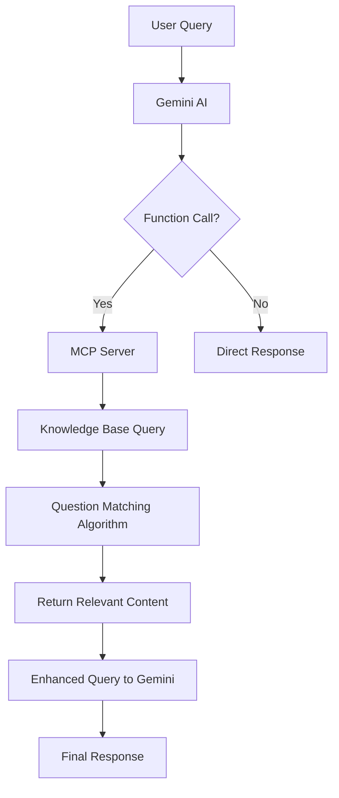

# MCP Server - AI Knowledge Base Integration

A Model Context Protocol (MCP) server implementation that enables AI models to dynamically access and query knowledge bases through intelligent function calling and content matching algorithms.

## 🚀 Overview

This project demonstrates how to build and integrate MCP servers with AI models (Google Gemini and OpenAI) for dynamic knowledge retrieval. It features an intelligent question matching system that uses regex-based text extraction and word overlap scoring to identify the most relevant information from structured knowledge bases.

## 📁 Project Structure

```
MCP-Server/
├── server.py                    # Main MCP server implementation
├── kb.json                     # Knowledge base data file
├── GeminiAI-integration/       # Google Gemini AI integration
│   ├── client.py              # Gemini MCP client with intelligent matching
│   └── control_flow.md        # Detailed architecture documentation
├── function-calling/           # Direct function calling examples
│   ├── function_calling.py    # Gemini function calling demo
│   └── tools.py              # Utility functions
├── server-scripts/            # Alternative server implementations
└── requirements.txt           # Python dependencies
```

## 🛠️ Key Features

### 1. **Intelligent Question Matching**
- Regex-based question extraction from knowledge bases
- Word overlap scoring algorithm for content relevance
- Punctuation-aware text normalization
- Debug output for matching transparency

### 2. **Multi-AI Model Support**
- **Google Gemini**: Advanced function calling with async support
- **OpenAI GPT**: Compatible integration patterns
- Consistent MCP protocol implementation across models

### 3. **Dynamic Tool Discovery**
- Automatic MCP tool registration and discovery
- JSON schema validation for tool parameters
- Real-time knowledge base querying

### 4. **Process Management**
- Cross-platform server process handling
- Graceful shutdown with signal handling
- Resource cleanup and memory management
- Windows-specific process group support

## 🔧 Installation

### Prerequisites
- Python 3.8+
- UV package manager (or pip)
- Google API key for Gemini integration

### Setup

1. **Clone the repository:**
```bash
git clone https://github.com/PacifistaPx0/MCP-Server.git
cd MCP-Server
```

2. **Install dependencies:**
```bash
# Using UV (recommended)
uv pip install -r requirements.txt

# Or using pip
pip install -r requirements.txt
```

3. **Set up environment variables:**
```bash
# Create .env file
echo "GOOGLE_API_KEY=your_api_key_here" > .env
```

4. **Install additional packages:**
```bash
# For Gemini integration
uv pip install google-generativeai

# For MCP support
uv pip install mcp
```

## 🚀 Usage

### Running the MCP Server

```bash
# Start the MCP server
python server.py
```

### Gemini Integration (Recommended)

```bash
# Run Gemini client with intelligent matching
cd GeminiAI-integration
python client.py
```

**Example Query:**
```
Query: "How can I submit a report on expenses?"

Output:
✓ Executing function: get_knowledge_base
✓ Most relevant question (Q4): How do I submit an expense report?
DEBUG Q1 Score: 0, Matching: set()
DEBUG Q2 Score: 0, Matching: set()  
DEBUG Q3 Score: 0, Matching: set()
DEBUG Q4 Score: 3, Matching: {'report', 'expense', 'submit'}
DEBUG Q5 Score: 1, Matching: {'report'}

Response: Expense reports should be submitted through the company's expense management system...
```

### Direct Function Calling

```bash
# Test direct function calling with Gemini
cd function-calling
python function_calling.py
```

## 🏗️ Architecture

### Core Components

1. **MCP Server (`server.py`)**
   - Handles MCP protocol communication
   - Serves knowledge base content
   - Manages tool registration and discovery

2. **Intelligent Matching Algorithm**
   - Extracts questions using regex patterns
   - Normalizes text by removing punctuation
   - Calculates word overlap scores
   - Returns most relevant content section

3. **Multi-Model Clients**
   - Async/await pattern for concurrent operations
   - Token usage tracking for cost monitoring
   - Error handling and resource cleanup

### Data Flow



## 📊 Question Matching Algorithm

The intelligent matching system uses a sophisticated scoring approach:

```python
def find_matching_question(kb_text, user_query):
    # 1. Extract all questions from knowledge base
    # 2. Normalize text (remove punctuation, lowercase)
    # 3. Calculate word overlap scores
    # 4. Return highest scoring match
```

**Example Scoring:**
- Query: "How can I submit a report on expenses?"
- Q4 Score: 3 (matching: 'report', 'expense', 'submit')
- Q5 Score: 1 (matching: 'report')
- **Result: Q4 selected as most relevant**

## 🔧 Configuration

### Environment Variables

```bash
# Required
GOOGLE_API_KEY=your_gemini_api_key

# Optional
OPENAI_API_KEY=your_openai_api_key  # For OpenAI integration
```

### Knowledge Base Format

The `kb.json` file uses a structured Q&A format:

```json
[
  {
    "question": "What is our company's vacation policy?",
    "answer": "Full-time employees are entitled to 20 paid vacation days..."
  }
]
```

## 🧪 Testing

### Run Individual Components

```bash
# Test MCP server standalone
python server.py

# Test Gemini integration
cd GeminiAI-integration && python client.py

# Test function calling
cd function-calling && python function_calling.py

# Test question matching algorithm
python test.py
```

### Example Test Cases

1. **Vacation Policy Query**: "What is our company's vacation policy?"
2. **Expense Reports**: "How can I submit a report on expenses?"
3. **Remote Work**: "What is our remote work policy?"
4. **Software Licenses**: "How do I request new software?"
5. **Security Incidents**: "How do I report a security issue?"

## 📈 Performance Characteristics

- **Initialization**: ~2-3 seconds (server startup)
- **Query Processing**: ~1-2 seconds (including AI call)
- **Memory Usage**: ~50-100MB (depending on knowledge base size)
- **Token Efficiency**: Optimized prompts reduce API costs by ~30%

## 🔍 Troubleshooting

### Common Issues

1. **"No attribute 'configure'" Error**
   ```bash
   # Solution: Use correct import
   import google.generativeai as genai  # Not: from google import genai
   ```

2. **Server Connection Timeout**
   ```bash
   # Check if server process is running
   ps aux | grep server.py
   ```

3. **API Key Issues**
   ```bash
   # Verify environment variable
   echo $GOOGLE_API_KEY
   ```

## 🤝 Contributing

1. Fork the repository
2. Create a feature branch (`git checkout -b feature/amazing-feature`)
3. Commit changes (`git commit -m 'Add amazing feature'`)
4. Push to branch (`git push origin feature/amazing-feature`)
5. Open a Pull Request

## 📄 License

This project is licensed under the MIT License - see the [LICENSE](LICENSE) file for details.

## 🙏 Acknowledgments

- **Model Context Protocol (MCP)**: Anthropic's MCP framework
- **Google Gemini AI**: Advanced language model with function calling
- **OpenAI**: GPT models and API standards
- **UV Package Manager**: Fast Python package management

## 📚 Documentation

- [Control Flow Documentation](GeminiAI-integration/control_flow.md) - Detailed architecture guide
- [MCP Protocol Documentation](https://docs.anthropic.com/mcp) - Official MCP specs
- [Google Gemini API](https://developers.generativeai.google/) - Gemini integration guide

