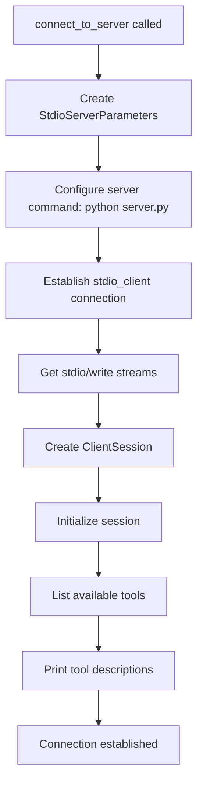
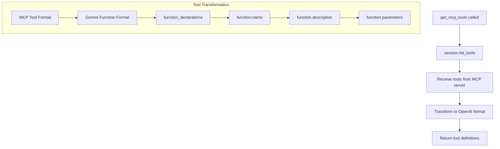
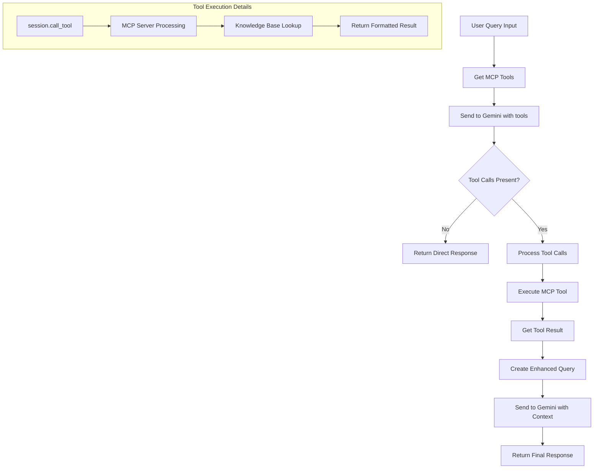
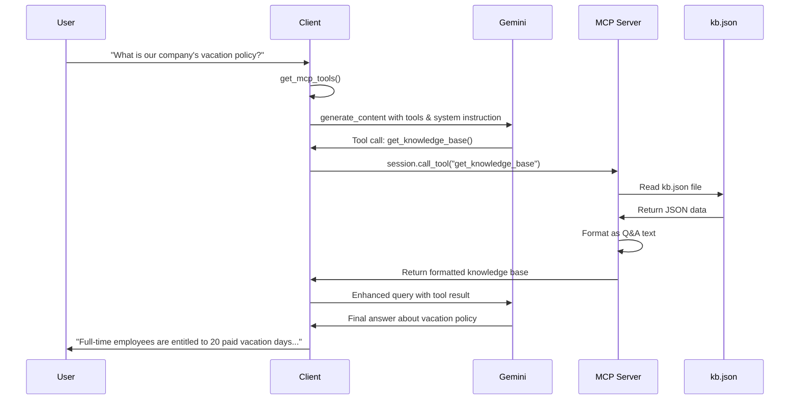

# MCP-Gemini Client Control Flow

## Overview
This document explains how the `client.py` file works, tracing the execution flow from initialization to query processing using MCP (Model Context Protocol) tools with Google Gemini AI.

## High-Level Architecture

```
┌─────────────────┐    ┌─────────────────┐    ┌─────────────────┐
│   User Query    │    │  MCP Server     │    │  Gemini API     │
│                 │    │  (server.py)    │    │  (Google AI)    │
└─────────────────┘    └─────────────────┘    └─────────────────┘
         │                       │                       │
         ▼                       │                       │
┌─────────────────┐              │                       │
│  client.py      │◄─────────────┼───────────────────────┤
│ MCPGenAIClient  │              │                       │
└─────────────────┘              │                       │
         │                       │                       │
         └───────────────────────┼───────────────────────┘
                                 │
                        ┌─────────────────┐
                        │  Knowledge Base │
                        │    (kb.json)    │
                        └─────────────────┘
```

## Detailed Control Flow

### 1. Initialization Phase

```python
class MCPGenAIClient:
    def __init__(self, model: str = "gemini-2.0-flash"):
```

**Flow:**
1. **Class Instantiation** → Creates MCPGenAIClient instance
2. **Initialize Variables**:
   - `session: Optional[ClientSession] = None` → Will hold MCP session
   - `exit_stack = AsyncExitStack()` → Manages async cleanup
   - `client = genai.Client()` → Google Gemini API client
   - `model = model` → Gemini model to use (default: gemini-2.0-flash)
   - `stdio/write = None` → Will hold server communication streams
   - `total_tokens_used = 0` → Token usage tracking
   - `encoding = tiktoken.encoding_for_model("gpt-4")` → Token counting (approximation)

### 2. Server Connection Phase

```python
async def connect_to_server(self, server_script_path: str = "../server.py"):
```

**Flow:**


**Detailed Steps:**
1. **Server Parameters Setup**:
   ```python
   server_params = StdioServerParameters(
       command="python",
       args=[server_script_path],  # "server.py"
       creationflags=subprocess.CREATE_NEW_PROCESS_GROUP if os.name == 'nt' else 0
   )
   ```

2. **Transport Connection**:
   ```python
   stdio_transport = await self.exit_stack.enter_async_context(
       stdio_client(server_params)
   )
   # Store reference to server process for cleanup
   if hasattr(stdio_transport, '_process'):
       server_process = stdio_transport._process
   ```
   - Spawns `python server.py` as subprocess
   - Establishes stdio communication pipes
   - Managed by exit_stack for cleanup
   - Stores process reference for signal handling

3. **Session Creation**:
   ```python
   self.stdio, self.write = stdio_transport
   self.session = await self.exit_stack.enter_async_context(
       ClientSession(self.stdio, self.write)
   )
   ```

4. **Initialization & Discovery**:
   ```python
   await self.session.initialize()
   tools_result = await self.session.list_tools()
   ```
   - Sends MCP initialization messages
   - Discovers available tools (e.g., `get_knowledge_base`)

### 3. Tool Discovery Phase

```python
async def get_mcp_tools(self) -> List[Dict[str, Any]]:
```

**Flow:**


**Transformation Process:**
- **Input (MCP format)**:
  ```python
  tool.name = "get_knowledge_base"
  tool.description = "Retrieve entire knowledge base as string"
  tool.inputSchema = {...}
  ```

- **Output (Gemini format)**:
  ```python
  {
      "function_declarations": [{
          "name": "get_knowledge_base",
          "description": "Retrieve entire knowledge base as string. Use this tool to retrieve company information and policies.",
          "parameters": {...}
      }]
  }
  ```

### 4. Query Processing Phase

```python
async def process_query(self, query: str) -> str:
```

**Flow:**


**Detailed Steps:**

1. **Initial Gemini Call**:
   ```python
   response = await self.client.aio.models.generate_content(
       model=self.model,
       contents=contents,
       config=genai.types.GenerateContentConfig(
           tools=tools,
           temperature=0.1,
       )
   )
   ```
   - Sends user query to Gemini with system instruction
   - Includes available MCP tools
   - Gemini decides if tools are needed

2. **System Instruction & Context**:
   ```python
   system_instruction = """You are a helpful assistant with access to company knowledge base tools. 
   When asked about company policies, procedures, or information, you MUST use the available tools to retrieve the most current information.
   Always use the get_knowledge_base tool when answering questions about company policies."""
   
   contents = [
       {"role": "user", "parts": [{"text": f"{system_instruction}\n\nUser question: {query}"}]}
   ]
   ```

3. **Tool Call Processing** (if present):
   ```python
   for part in candidate.content.parts:
       if hasattr(part, 'function_call') and part.function_call:
           result = await self.session.call_tool(
               part.function_call.name,          # "get_knowledge_base"
               arguments=dict(part.function_call.args),
           )
   ```

4. **Enhanced Query Creation**:
   ```python
   final_query = f"""Original question: {query}

Knowledge base information retrieved:
{result.content[0].text}

Based on this information from our company knowledge base, please provide a comprehensive answer to the original question."""
   ```

5. **Final Gemini Call**:
   ```python
   final_response = await self.client.aio.models.generate_content(
       model=self.model,
       contents=final_query
   )
   ```

### 5. Example Execution Flow

**Query**: "What is our company's vacation policy?"



### 6. Resource Cleanup

```python
async def cleanup(self):
    await self.exit_stack.aclose()
```

**Flow:**
- Closes MCP session
- Terminates server subprocess with signal handling
- Cleans up stdio streams
- Releases all async resources
- Handles graceful and force termination

## Signal Handling

```python
def signal_handler(signum, frame):
    """Handle Ctrl+C gracefully."""
    print(f"\n🛑 Received interrupt signal ({signum}). Shutting down...")
    
    global server_process
    if server_process:
        try:
            server_process.terminate()
            server_process.wait(timeout=5)
        except Exception:
            server_process.kill()
    
    sys.exit(0)
```

**Features:**
- Proper Ctrl+C handling
- Graceful server process termination
- Force kill as fallback
- Cross-platform signal handling

## Key Components Integration

### 1. **AsyncExitStack**
- Manages lifecycle of async resources
- Ensures proper cleanup on exit
- Handles server subprocess termination

### 2. **ClientSession (MCP)**
- Handles MCP protocol communication
- Manages JSON-RPC message exchange
- Provides tool discovery and execution

### 3. **Google GenAI Client**
- Handles Gemini API communication
- Manages content generation with tools
- Processes function calls and responses
- Supports async operations via `aio.models.generate_content`

### 4. **StdioServerParameters**
- Configures server subprocess
- Sets up communication pipes
- Defines server startup command
- Includes Windows-specific process flags

### 5. **Token Counting (tiktoken)**
- Approximates Gemini token usage using GPT-4 encoding
- Tracks total tokens used across requests
- Provides cost estimation capabilities

## Error Handling Points

1. **Server Connection**: If `python server.py` fails
2. **Tool Discovery**: If MCP tools unavailable
3. **Gemini API**: Rate limits, API errors, quota issues
4. **Tool Execution**: MCP server errors
5. **JSON Parsing**: Malformed tool arguments
6. **Signal Handling**: Process interruption and cleanup
7. **API Key**: Missing or invalid GOOGLE_API_KEY

## Performance Characteristics

- **Initialization**: One-time server startup cost
- **Tool Discovery**: Cached after first call
- **Query Processing**: 2 Gemini API calls if tools used
- **Tool Execution**: Direct MCP server communication
- **Cleanup**: Graceful resource termination with signal handling
- **Token Counting**: Approximated using tiktoken (GPT-4 encoding)
- **Memory Usage**: Efficient with AsyncExitStack management

## Usage Pattern

```python
# 1. Create client
client = MCPGenAIClient(api_key=os.getenv("GOOGLE_API_KEY"))

# 2. Connect to MCP server
await client.connect_to_server("server.py")

# 3. Process queries (can be multiple)
response = await client.process_query("Your question here")

# 4. Cleanup (in finally block)
await client.cleanup()
```

## Key Differences from OpenAI Implementation

### **API Format:**
- **OpenAI**: `chat.completions.create()` with `messages` array
- **Gemini**: `aio.models.generate_content()` with `contents` object

### **Tool Format:**
- **OpenAI**: `{"type": "function", "function": {...}}`
- **Gemini**: `{"function_declarations": [{...}]}`

### **Response Handling:**
- **OpenAI**: `response.choices[0].message.tool_calls`
- **Gemini**: `response.candidates[0].content.parts[].function_call`

### **Final Response:**
- **OpenAI**: Conversation-based with role continuity
- **Gemini**: Enhanced query approach with context injection

This architecture enables seamless integration between Google Gemini models and custom MCP tools, allowing AI to access and process structured knowledge bases dynamically with improved token efficiency and cost-effectiveness.
