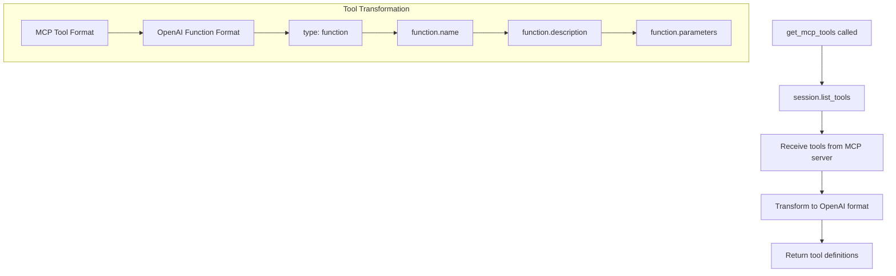
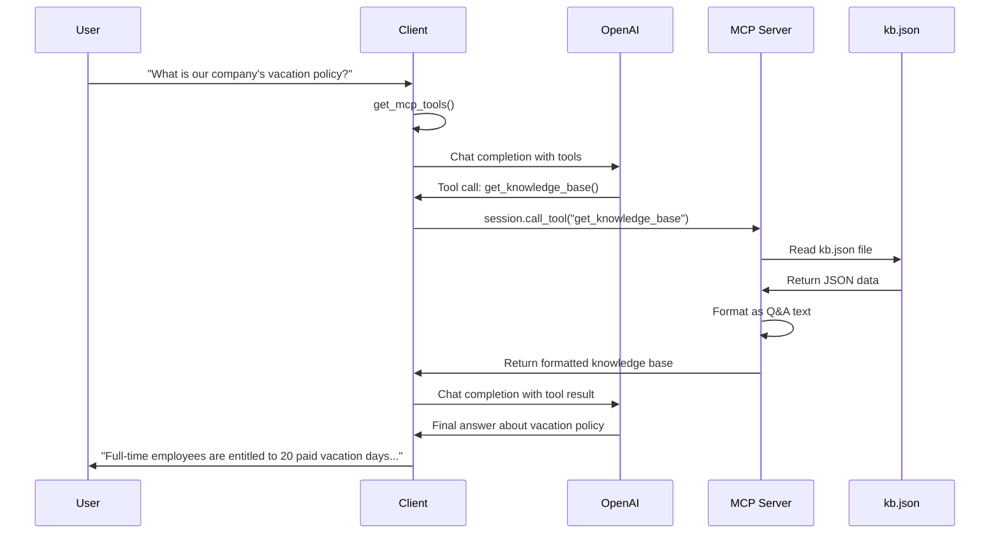

# MCP-OpenAI Client Control Flow

## Overview
This document explains how the `client.py` file works, tracing the execution flow from initialization to query processing using MCP (Model Context Protocol) tools with OpenAI.

## High-Level Architecture

```
┌─────────────────┐    ┌─────────────────┐    ┌─────────────────┐
│   User Query    │    │  MCP Server     │    │   OpenAI API    │
│                 │    │  (server.py)    │    │                 │
└─────────────────┘    └─────────────────┘    └─────────────────┘
         │                       │                       │
         ▼                       │                       │
┌─────────────────┐              │                       │
│  client.py      │◄─────────────┼───────────────────────┤
│ MCPOpenAIClient │              │                       │
└─────────────────┘              │                       │
         │                       │                       │
         └───────────────────────┼───────────────────────┘
                                 │
                        ┌─────────────────┐
                        │  Knowledge Base │
                        │    (kb.json)    │
                        └─────────────────┘
```

## Detailed Control Flow

### 1. Initialization Phase

```python
class MCPOpenAIClient:
    def __init__(self, model: str = "gpt-4o"):
```

**Flow:**
1. **Class Instantiation** → Creates MCPOpenAIClient instance
2. **Initialize Variables**:
   - `session: Optional[ClientSession] = None` → Will hold MCP session
   - `exit_stack = AsyncExitStack()` → Manages async cleanup
   - `openai_client = AsyncOpenAI()` → OpenAI API client
   - `model = model` → GPT model to use (default: gpt-4o)
   - `stdio/write = None` → Will hold server communication streams

### 2. Server Connection Phase

```python
async def connect_to_server(self, server_script_path: str = "../server.py"):
```

**Flow:**


**Detailed Steps:**
1. **Server Parameters Setup**:
   ```python
   server_params = StdioServerParameters(
       command="python",
       args=[server_script_path],  # "server.py"
   )
   ```

2. **Transport Connection**:
   ```python
   stdio_transport = await self.exit_stack.enter_async_context(
       stdio_client(server_params)
   )
   ```
   - Spawns `python server.py` as subprocess
   - Establishes stdio communication pipes
   - Managed by exit_stack for cleanup

3. **Session Creation**:
   ```python
   self.stdio, self.write = stdio_transport
   self.session = await self.exit_stack.enter_async_context(
       ClientSession(self.stdio, self.write)
   )
   ```

4. **Initialization & Discovery**:
   ```python
   await self.session.initialize()
   tools_result = await self.session.list_tools()
   ```
   - Sends MCP initialization messages
   - Discovers available tools (e.g., `get_knowledge_base`)

### 3. Tool Discovery Phase

```python
async def get_mcp_tools(self) -> List[Dict[str, Any]]:
```

**Flow:**


**Transformation Process:**
- **Input (MCP format)**:
  ```python
  tool.name = "get_knowledge_base"
  tool.description = "Retrieve entire knowledge base as string"
  tool.inputSchema = {...}
  ```

- **Output (OpenAI format)**:
  ```python
  {
      "type": "function",
      "function": {
          "name": "get_knowledge_base",
          "description": "Retrieve entire knowledge base as string",
          "parameters": {...}
      }
  }
  ```

### 4. Query Processing Phase

```python
async def process_query(self, query: str) -> str:
```

**Flow:**


**Detailed Steps:**

1. **Initial OpenAI Call**:
   ```python
   response = await self.openai_client.chat.completions.create(
       model=self.model,
       messages=[{"role": "user", "content": query}],
       tools=tools,
       tool_choice="auto",
   )
   ```
   - Sends user query to OpenAI
   - Includes available MCP tools
   - OpenAI decides if tools are needed

2. **Message History Setup**:
   ```python
   messages = [
       {"role": "user", "content": query},
       assistant_message,
   ]
   ```

3. **Tool Call Processing** (if present):
   ```python
   for tool_call in assistant_message.tool_calls:
       result = await self.session.call_tool(
           tool_call.function.name,          # "get_knowledge_base"
           arguments=json.loads(tool_call.function.arguments),
       )
   ```

4. **Tool Result Integration**:
   ```python
   messages.append({
       "role": "tool",
       "tool_call_id": tool_call.id,
       "content": result.content[0].text,  # KB content
   })
   ```

5. **Final OpenAI Call**:
   ```python
   final_response = await self.openai_client.chat.completions.create(
       model=self.model,
       messages=messages,
       tools=tools,
       tool_choice="none",  # No more tool calls
   )
   ```

### 5. Example Execution Flow

**Query**: "What is our company's vacation policy?"



### 6. Resource Cleanup

```python
async def cleanup(self):
    await self.exit_stack.aclose()
```

**Flow:**
- Closes MCP session
- Terminates server subprocess
- Cleans up stdio streams
- Releases all async resources

## Key Components Integration

### 1. **AsyncExitStack**
- Manages lifecycle of async resources
- Ensures proper cleanup on exit
- Handles server subprocess termination

### 2. **ClientSession (MCP)**
- Handles MCP protocol communication
- Manages JSON-RPC message exchange
- Provides tool discovery and execution

### 3. **AsyncOpenAI**
- Handles OpenAI API communication
- Manages conversation context
- Processes tool calls and responses

### 4. **StdioServerParameters**
- Configures server subprocess
- Sets up communication pipes
- Defines server startup command

## Error Handling Points

1. **Server Connection**: If `python server.py` fails
2. **Tool Discovery**: If MCP tools unavailable
3. **OpenAI API**: Rate limits, API errors
4. **Tool Execution**: MCP server errors
5. **JSON Parsing**: Malformed tool arguments

## Performance Characteristics

- **Initialization**: One-time server startup cost
- **Tool Discovery**: Cached after first call
- **Query Processing**: 2 OpenAI API calls if tools used
- **Tool Execution**: Direct MCP server communication
- **Cleanup**: Graceful resource termination

## Usage Pattern

```python
# 1. Create client
client = MCPOpenAIClient()

# 2. Connect to MCP server
await client.connect_to_server("server.py")

# 3. Process queries (can be multiple)
response = await client.process_query("Your question here")

# 4. Cleanup (in finally block)
await client.cleanup()
```

This architecture enables seamless integration between OpenAI's language models and custom MCP tools, allowing AI to access and process structured knowledge bases dynamically.
